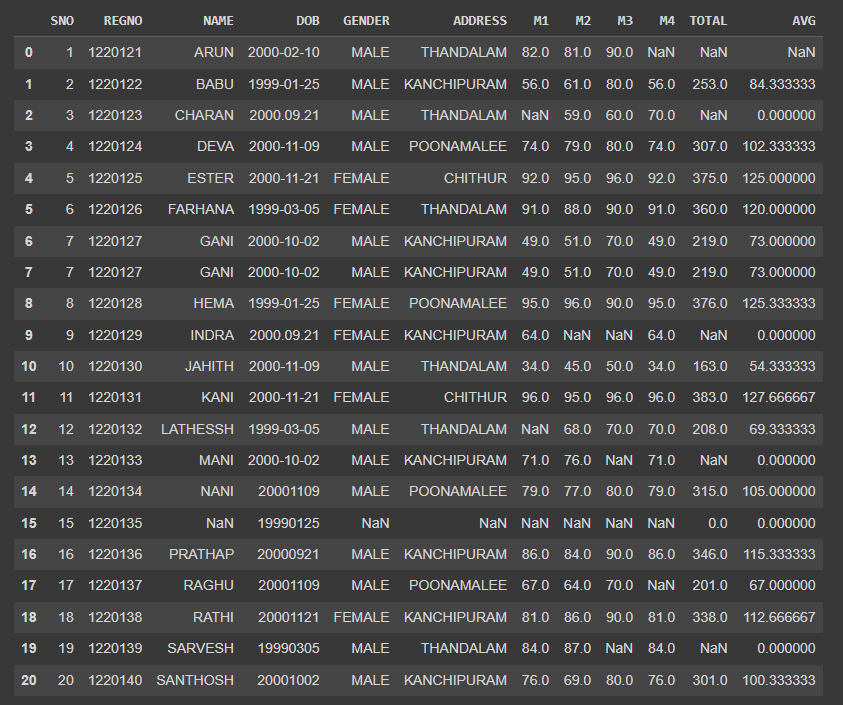
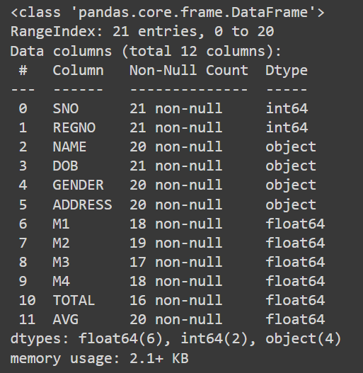
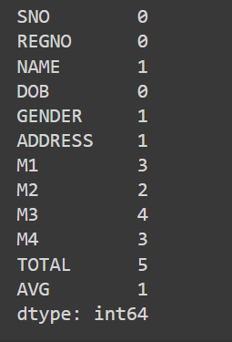
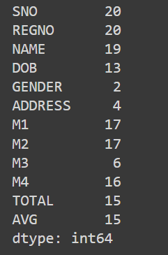
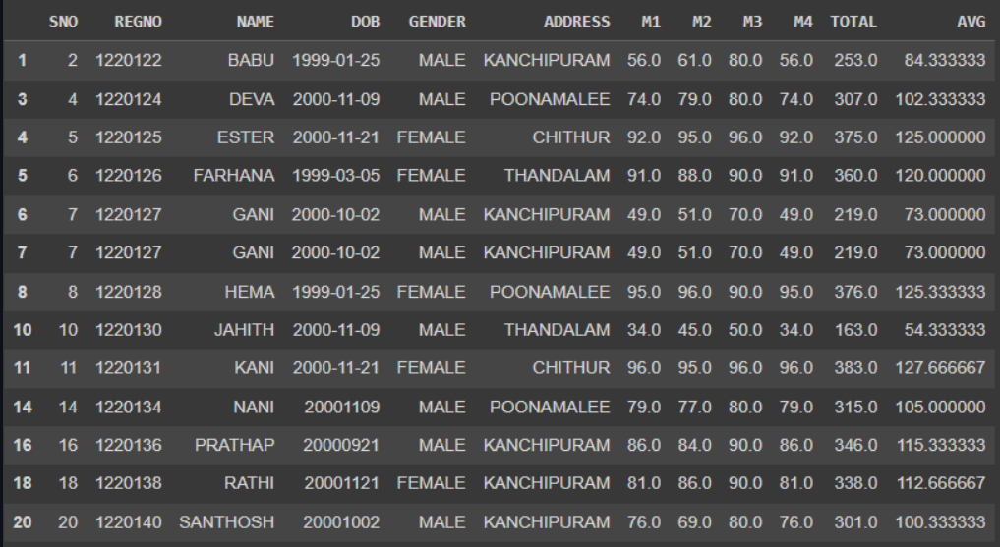
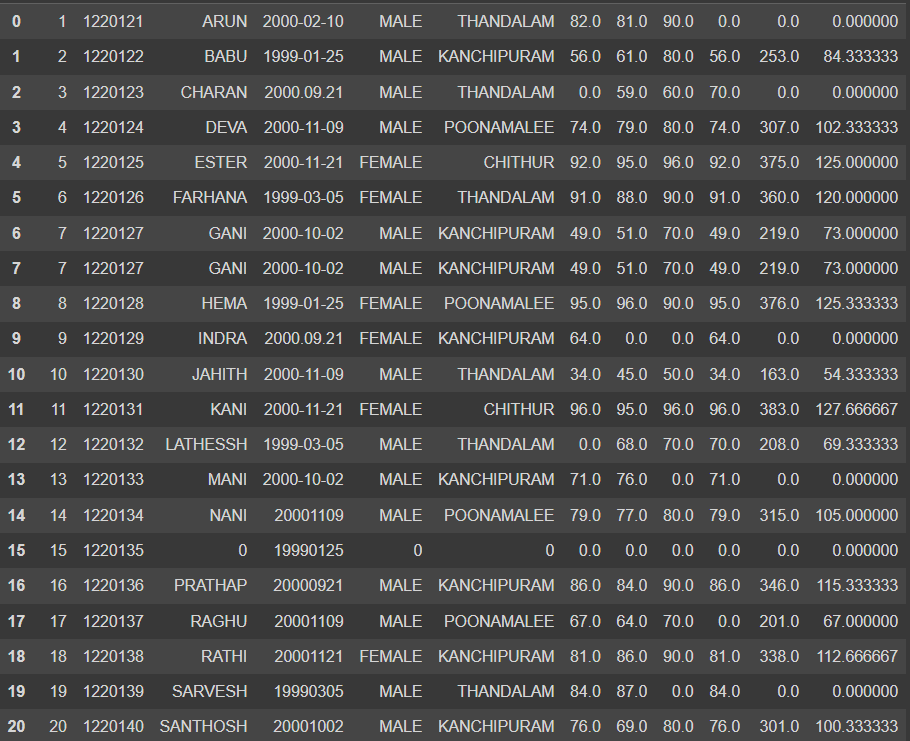
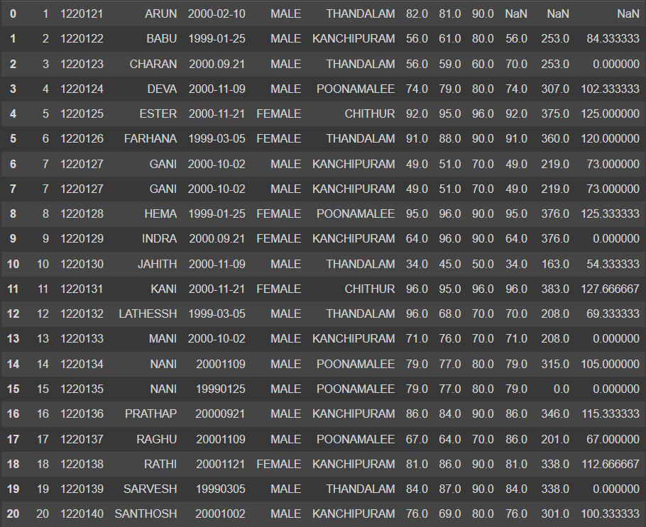
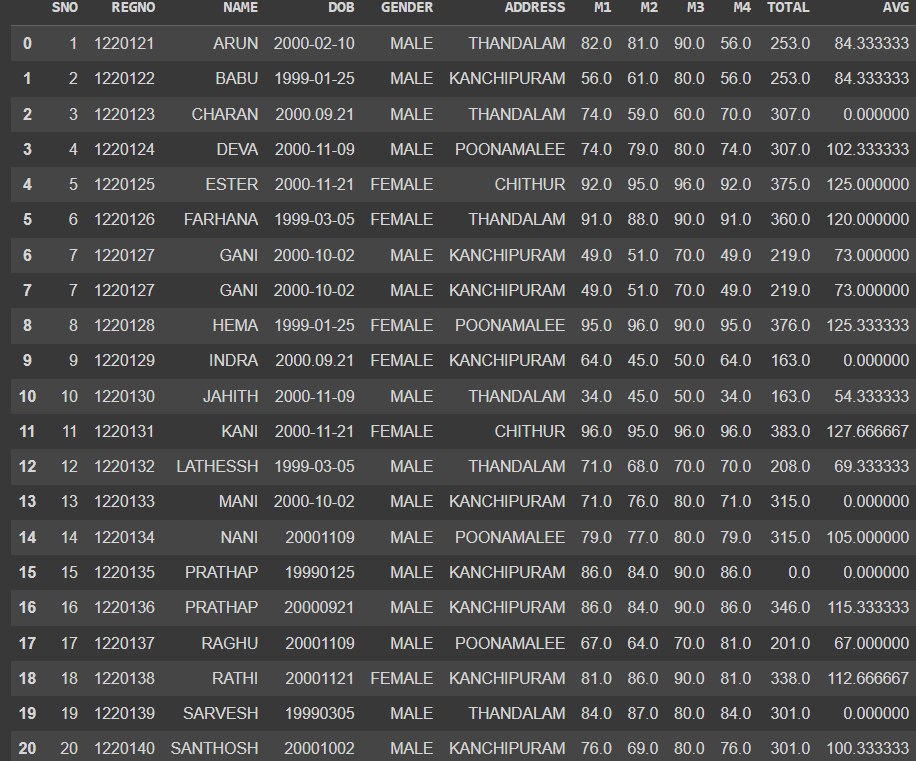

# Ex : 1 Data Cleaning Process

## AIM
To read the given data and perform data cleaning and save the cleaned data to a file.

## Explanation
Data cleaning is the process of preparing data for analysis by removing or modifying data that is incorrect ,incompleted , irrelevant , duplicated or improperly formatted. Data cleaning is not simply about erasing data ,but rather finding a way to maximize datasets accuracy without necessarily deleting the information.

## Algorithm
STEP 1: Read the given Data

STEP 2: Get the information about the data

STEP 3: Remove the null values from the data

STEP 4: Save the Clean data to the file

STEP 5: Remove outliers using IQR

STEP 6: Use zscore of to remove outliers

## Coding and Output
```
import pandas as pd
df=pd.read_csv("SAMPLEIDS.csv")
df
```

```
df.info()
```


```
df.isnull().sum()
```


```
df.nunique()
```


```
df.dropna()
```

```
d1=df.fillna(0)
d1
```


```
d2=df.fillna(method='ffill')
d2
```


```
d3=df.fillna(method='bfill')
d3
```


```
delete=df.dropna()
delete
```


## IQR(Inter Quartile Range)
```
ir=pd.read_csv('iris.csv')
ir
```


```
ir.describe()
```


```
sns.boxplot(x='sepal_width',data=ir)
```


```
c1=ir.sepal_width.quantile(0.25)
c3=ir.sepal_width.quantile(0.75)
iq=c3-c1
print(c3)
```

```

rid=ir[((ir.sepal_width<(c1-1.5*iq))|(ir.sepal_width>(c3+1.5*iq)))]
rid['sepal_width']
```


```
delid=ir[~((ir.sepal_width<(c1-1.5*iq))|(ir.sepal_width>(c3+1.5*iq)))]
delid
```

```
sns.boxplot(x='sepal_width',data=delid)
```


## Z-SCORE 
```
import matplotlib.pyplot as plt
import scipy.stats as stats
dataset=pd.read_csv("heights.csv")
dataset
```


```
df = pd.read_csv("heights.csv")
q1 = df['height'].quantile(0.25)
q2 = df['height'].quantile(0.5)
q3 = df['height'].quantile(0.75)
iqr = q3-q1
iqr
```


```
low = q1 - 1.5*iqr
low
```


```
high = q3 + 1.5*iqr
high
```


```
df1 = df[((df['height'] >=low)& (df['height'] <=high))]
df1
```


```
z = np.abs(stats.zscore(df['height']))
z
```


```
df1 = df[z<3]
df1
```


## Result
Hence the data was cleaned , outliers were detected and removed.
